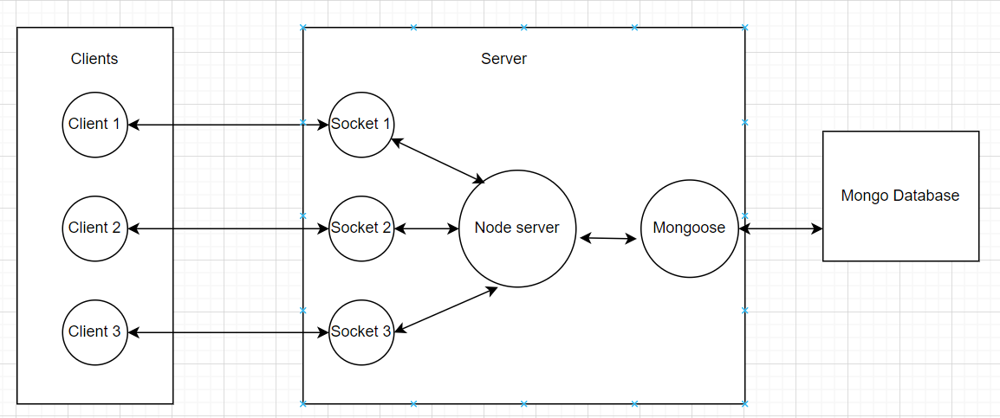

# Getting Started with Create React App

This project was bootstrapped with [Create React App](https://github.com/facebook/create-react-app).

## Available Scripts

In the project directory, you can run:

### `npm start`

Runs the app in the development mode.

## Backend Service
This service handles the logical part like DB Manipulations,socket connections.
Link: https://github.com/maitra100/QA-Clone-Server

Add env file with PORT:3000

## Architecture

## Caution
Don't reload the page once connected else the socket id for a connection for a user changes and then authorization stuff would break (used socket id for authorization instead of name to maintain full anonymity).

